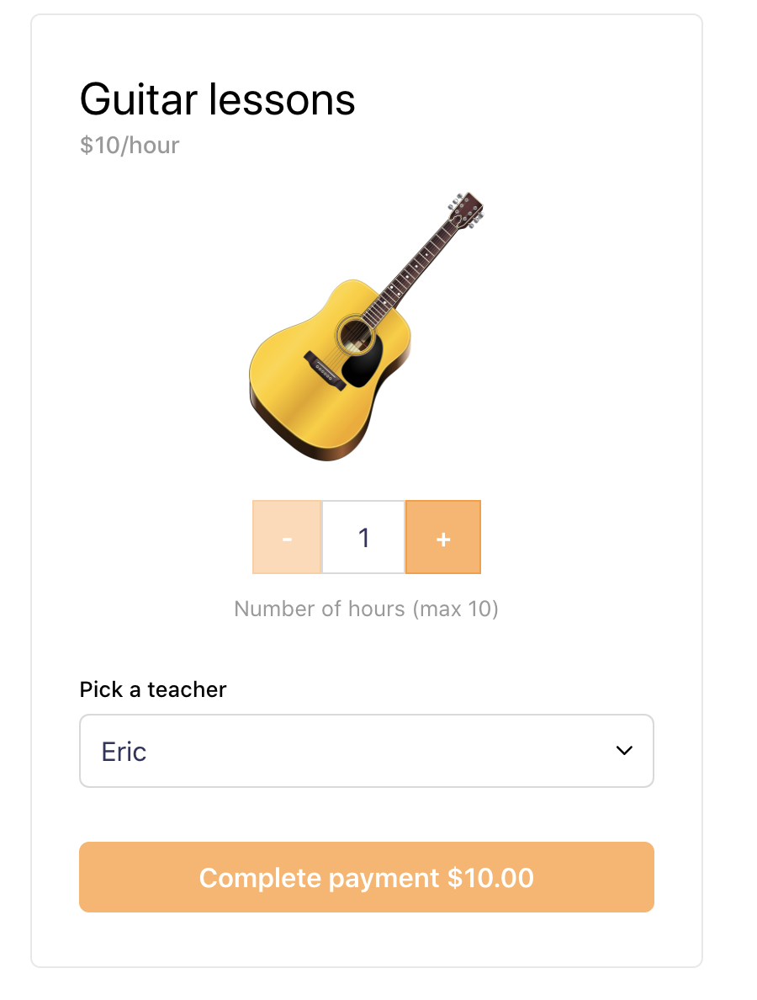

# Connect direct charges with Checkout

This Stripe sample shows you how to process a Connect [direct charge](https://stripe.com/docs/connect/direct-charges) using [Stripe Checkout](https://stripe.com/docs/payments/checkout).
Before using this sample, you should have onboarded at least one Connect account. For more about onboarding accounts and making Connect charges, read our [step-by-step Connect guide](https://stripe.com/docs/connect/enable-payment-acceptance-guide#accept-payment).

Demo url: https://eemtf.sse.codesandbox.io/

Sandbox url: https://codesandbox.io/s/connect-direct-charge-checkout-eemtf
(note: the Checkout link won't work in the inline browser on codesandbox.io)



## How to run locally

This sample includes 5 server implementations in Node, Ruby, Python, Java, and PHP.

Follow the steps below to run locally.

**1. Clone and configure the sample**

The Stripe CLI is the fastest way to clone and configure a sample to run locally.

**Using the Stripe CLI**

If you haven't already installed the CLI, follow the [installation steps](https://github.com/stripe/stripe-cli#installation) in the project README. The CLI is useful for cloning samples and locally testing webhooks and Stripe integrations.

In your terminal shell, run the Stripe CLI command to clone the sample:

```
stripe samples create connect-direct-charge-checkout
```

The CLI will walk you through picking your integration type, server and client languages. Make sure to configure your .env file as shown below.

**Installing and cloning manually**

If you do not want to use the Stripe CLI, you can manually clone and configure the sample yourself:

```
git clone https://github.com/stripe-samples/connect-direct-charge-checkout
```

**Configuring your .env file**

Copy the .env.example file into a file named .env in the folder of the server you want to use. For example:

```
cp .env.example server/node/.env
```

You will need a Stripe account in order to run the demo. Once you set up your account, go to the Stripe [developer dashboard](https://stripe.com/docs/development#api-keys) to find your API keys.

```
STRIPE_PUBLISHABLE_KEY=<replace-with-your-publishable-key>
STRIPE_SECRET_KEY=<replace-with-your-secret-key>
```

`STATIC_DIR` tells the server where to the client files are located and does not need to be modified unless you move the server files.

**2. Follow the server instructions on how to run:**

Pick the server language you want and follow the instructions in the server folder README on how to run.

For example, if you want to run the Node server:

```
cd server/node # there's a README in this folder with instructions
npm install
npm start
```

## FAQ

Q: Why did you pick these frameworks?

A: We chose the most minimal framework to convey the key Stripe calls and concepts you need to understand. These demos are meant as an educational tool that helps you roadmap how to integrate Stripe within your own system independent of the framework.

Q: Can you show me how to build X?

A: We are always looking for new sample ideas, please email dev-samples@stripe.com with your suggestion!

## Author(s)

@emorphis
